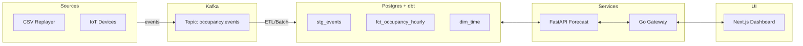

# Occupancy Platform

Real-time gym occupancy analytics with streaming ingest, a curated warehouse, forecast API, and a web dashboard. This monorepo demonstrates a production-style system across data engineering, backend, ML serving, frontend, testing, and ops.

---

## Table of Contents

- [Features](#features)
- [Architecture](#architecture)
- [Repository Layout](#repository-layout)
- [Quick Start](#quick-start)
- [Services & Endpoints](#services--endpoints)
- [SDKs](#sdks)
- [Data Flow](#data-flow)
- [Makefile Targets](#makefile-targets)
- [Configuration](#configuration)
- [Testing](#testing)
- [Monitoring](#monitoring)
- [Infrastructure (Optional)](#infrastructure-optional)
- [Roadmap](#roadmap)
- [License](#license)

---

## Features

- **Streaming ingest** from CSV replayer and IoT HTTP → Kafka
- **dbt models** on Postgres (staging → marts)
- **FastAPI forecast service** (hourly predictions)
- **Go gateway** (REST proxy; ready for WS fan-out)
- **Next.js + Tailwind dashboard**
- **Minimal SDKs** in TypeScript and Python
- **Prometheus + Grafana monitoring**
- **One-command local stack** via docker-compose and Makefile
- **Tests:** pytest, Playwright, k6/Locust

---

## Architecture



---

## Repository Layout

```
occupancy-platform/
├── apps/
│   └── dashboard/                 # Next.js + Tailwind (+ Playwright e2e)
├── services/
│   ├── gateway/                   # Go REST proxy → forecast
│   ├── ingest/                    # Go producers: csv / iot_http → Kafka
│   └── forecast/                  # FastAPI forecast API
├── dbt_occupancy/                 # dbt project (Postgres)
│   ├── models/staging/stg_events.sql
│   ├── models/marts/{fct_occupancy_hourly.sql,dim_time.sql}
│   └── seeds/gym_dataset.csv
├── data/raw/gym_occupancy/gym_dataset.csv   # optional copy for CSV replayer
├── monitoring/
│   ├── prometheus/{prometheus.yml,rules.yml}
│   └── grafana/dashboards/occupancy.json
├── ops/github/workflows/ci.yml    # CI: lint, tests, dbt build, e2e
├── packages/
│   ├── sdk-js/                    # TS client
│   └── sdk-py/                    # Python client
├── tests/                         # unit, integration, load
├── docker/                        # Dockerfiles
├── docker-compose.yml
├── Makefile
├── .env.example
└── README.md
```

---

## Quick Start

**Prereqs:** Docker, Docker Compose.

1. **Bring up local stack** (Kafka, Postgres, Redis, forecast, gateway, dashboard)
    ```sh
    make up
    ```
2. **Seed Postgres with dbt** (optional)
    ```sh
    make seed
    ```
3. **Replay CSV into Kafka** (simulated live events)
    ```sh
    make ingest
    ```

---

### Services

- **Dashboard:** http://localhost:3000
- **Gateway:** http://localhost:8080
- **Forecast:** http://localhost:8000
- **Postgres:** localhost:5432 (db: occupancy, user/pass: postgres/postgres)
- **Redis:** localhost:6379
- **Kafka:** localhost:9092

---

## Services & Endpoints

### Gateway (Go)

- `GET /healthz` → `{ "ok": true }`
- `GET /api/forecast/hourly?hours=24` → `[{"ts": ISO8601, "predicted": int}, ...]`
- `GET /api/occupancy/current` → `{ "ts": ISO8601, "predicted": int }`

### Forecast (FastAPI)

- `GET /health` → `{ "ok": true }`
- `GET /forecast/hourly?hours=24` → same payload (direct access)

---

## SDKs

### TypeScript (`packages/sdk-js`)

```typescript
import { current, forecast } from "@occupancy/sdk-js";

const now = await current();      // { ts, predicted }
const next = await forecast(24);  // [{ ts, predicted }, ...]
```

### Python (`packages/sdk-py`)

```python
from occupancy_sdk import Client

c = Client("http://localhost:8080")
print(c.current())
print(c.forecast(24))
```

---

## Data Flow

**Ingest**

- `services/ingest` runs either:
  - **csv mode:** time-scaled replay from `dbt_occupancy/seeds/gym_dataset.csv`
  - **http mode:** `POST /ingest` accepts `{ ts?, count, device_id }`
- Publishes JSON events to Kafka topic `occupancy.events`.

**Warehouse (dbt + Postgres)**

- dbt seed loads CSV → raw tables.
- dbt run builds `stg_events` then marts: `fct_occupancy_hourly`, `dim_time`.

**Forecast**

- Forecast service reads curated data; baseline model uses day-of-week + hour averages.
- Returns hourly predictions starting from the current hour.

**Gateway + Dashboard**

- Gateway proxies forecast responses.
- Dashboard pulls from the gateway and renders live charts.

---

## Makefile Targets

- `make up`       # build & start stack
- `make down`     # stop & remove volumes
- `make seed`     # dbt seed + run (Postgres)
- `make ingest`   # run CSV replayer into Kafka
- `make test`     # unit + integration tests
- `make e2e`      # Playwright E2E (dashboard)
- `make load`     # k6 load test (forecast by default)
- `make logs`     # tail gateway/forecast logs
- `make rebuild`  # rebuild images without cache

---

## Configuration

Copy `.env.example` → `.env` (as needed). Common variables:

| Variable              | Description                     | Default                        |
|-----------------------|---------------------------------|--------------------------------|
| FORECAST_URL          | Gateway → Forecast upstream     | http://forecast:8000           |
| OCCUPANCY_GATEWAY     | SDKs / dashboard base URL       | http://localhost:8080          |
| KAFKA_BROKERS         | Kafka bootstrap                 | localhost:9092 (compose)       |
| POSTGRES_DSN          | Postgres DSN                    | postgres://postgres:.../occupancy |
| NEXT_PUBLIC_API_URL   | Dashboard → Gateway base        | http://localhost:8080          |

---

## Testing

**Unit & Integration (Python)**

```sh
python -m pip install -r services/forecast/requirements.txt pytest requests
pytest -q tests/unit tests/integration
```

**Gateway smoke**

```sh
export GATEWAY_URL=http://localhost:8080
pytest -q tests/integration/test_gateway_http.py
```

**E2E (Playwright)**

```sh
make e2e
```

**Load (k6)**

- Forecast service directly:
    ```sh
    k6 run tests/load/k6_forecast.js --env BASE=http://localhost:8000 --env PATH=/forecast/hourly
    ```
- Gateway:
    ```sh
    k6 run tests/load/k6_forecast.js --env BASE=http://localhost:8080 --env PATH=/api/forecast/hourly
    ```

---

## Monitoring

- **Prometheus:** scrape configs in `monitoring/prometheus/`
- **Grafana:** dashboard JSON in `monitoring/grafana/dashboards/occupancy.json`
- Start stack (`make up`) and point your local Grafana to Prometheus if you add a Grafana container.

---

## Infrastructure 

- **Kubernetes:** manifests in `infra/k8s` (kustomize-ready)
- **Terraform:** `infra/terraform` provisions VPC, RDS (5432), ECR repositories

> Note: Terraform here doesn’t create compute or ALB. Add ECS/EKS/EC2 + SG/Ingress to expose the gateway (typically port 8080).

---

## Roadmap

- Replace baseline with XGBoost/LSTM + model registry
- Feature store & drift monitoring
- WebSocket push for live dashboard updates
- CI/CD to registry + cluster deploys
- Multi-site, zones, and device management

---

## License

MIT. Use, modify, and build on it.
